<h1 align="center">🎮 Education Math Adventure 2D 🎮</h1>

  <strong>🏆 Game Edukasi Matematika untuk Anak Usia 7-8 Tahun (Kelas 1 SD)</strong>

  Nikmati pengalaman belajar matematika yang seru dan menyenangkan melalui petualangan dunia 2D yang interaktif!

<h2>✨ Tentang Aplikasi</h2>

  <strong>Education Math Adventure 2D</strong> adalah game edukasi yang dirancang khusus berdasarkan <strong>Kurikulum Merdeka</strong>. Game ini berfungsi sebagai media evaluasi pembelajaran interaktif di luar jam sekolah yang sangat efektif untuk mengasah kemampuan matematika siswa/i kelas 1 SD.

  Dilengkapi dengan sistem navigasi yang mudah dipahami, visual yang unik, serta warna-warna ceria yang disukai anak-anak. Aplikasi ini hadir sebagai alternatif hiburan yang positif dan edukatif di tengah maraknya game online yang bersifat adiktif.

<h2>📱 Tampilan Aplikasi</h2>

  <em>Menu Utama</em>

  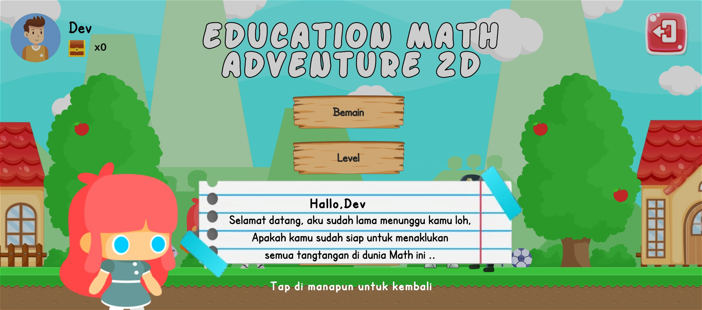
  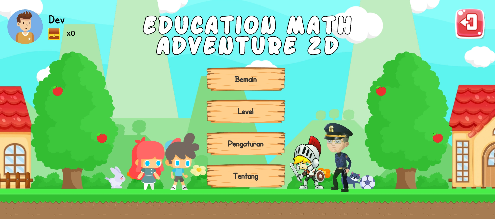
  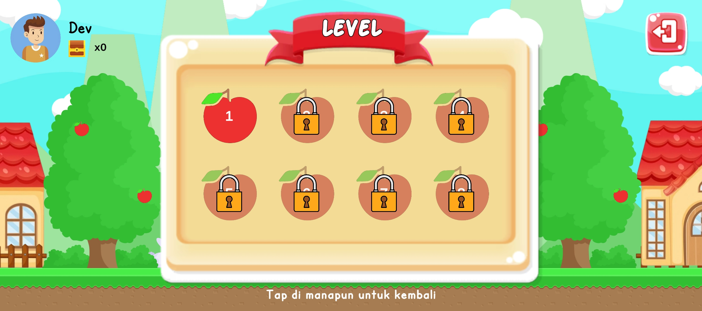

 

  <em>Gameplay & Quest</em>

  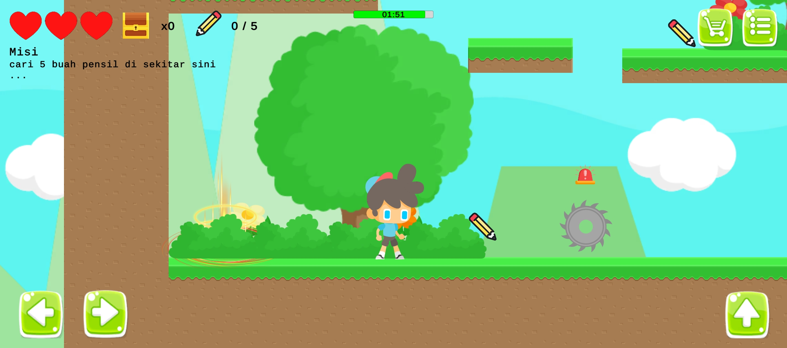
  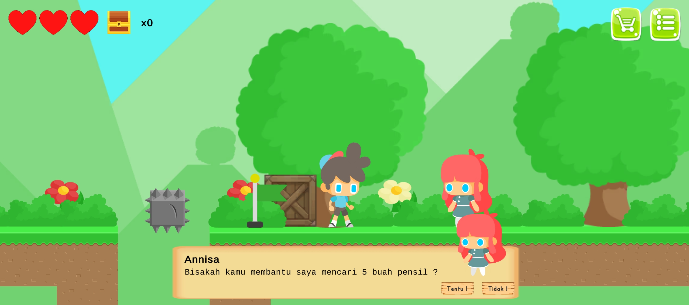
  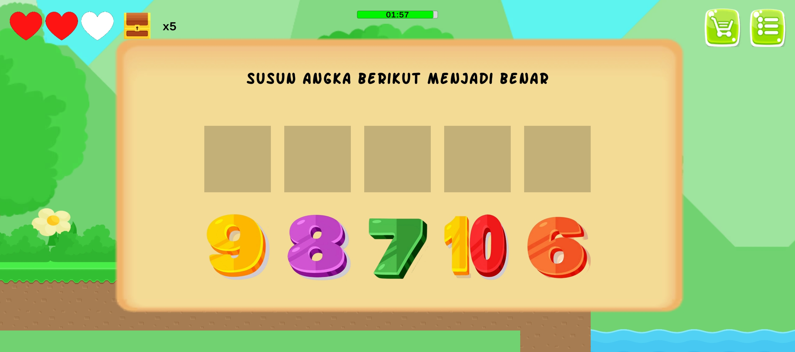
  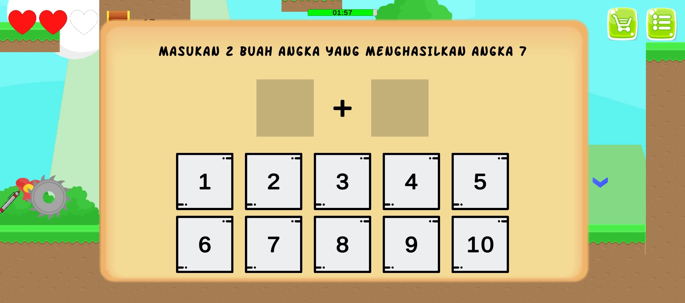
  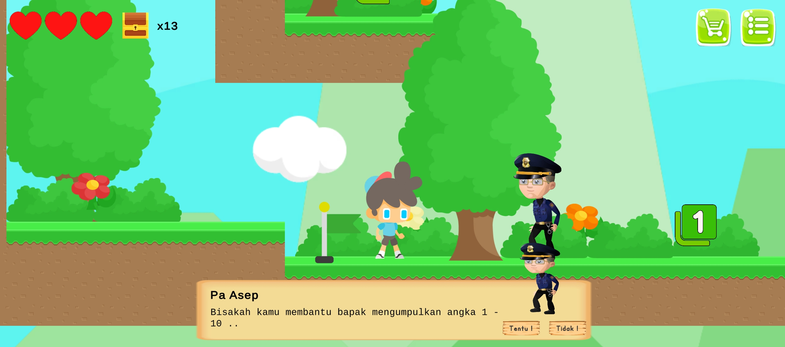

 

  <em>Profil & Progres Pengguna</em>

  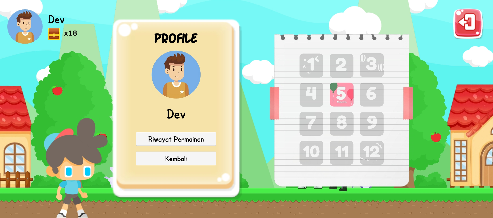
  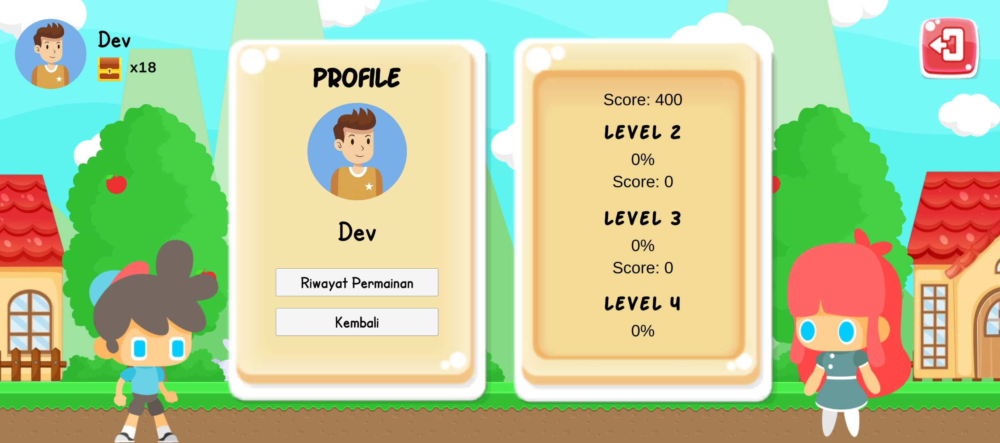

  <em>Reward and Shop</em>

  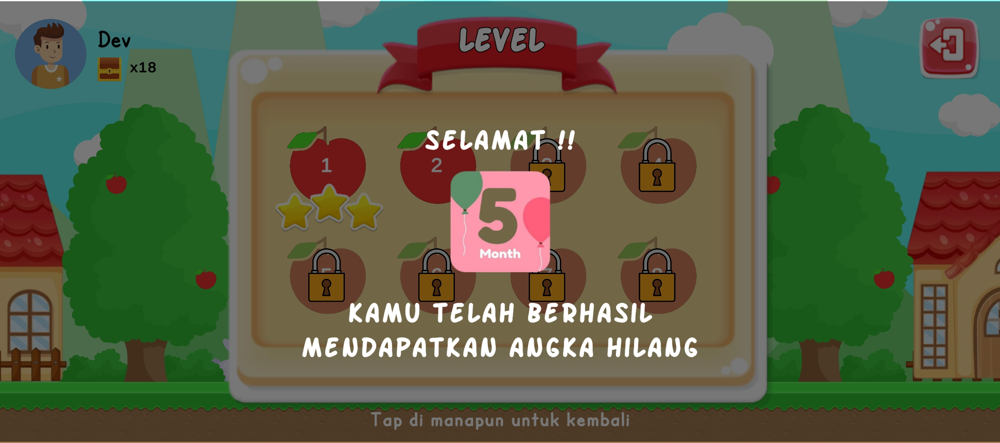
  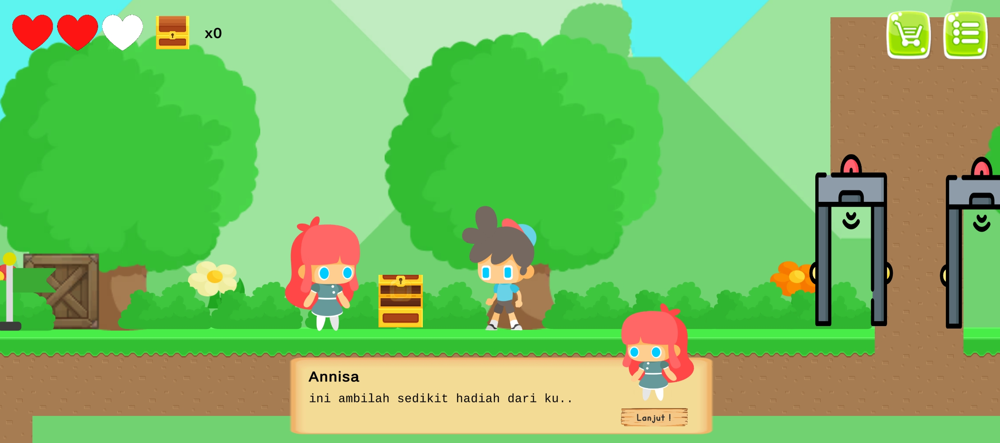
  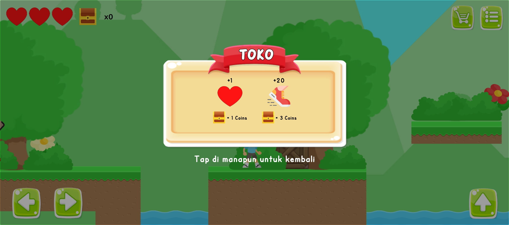
  

  <em>Result UI</em>

  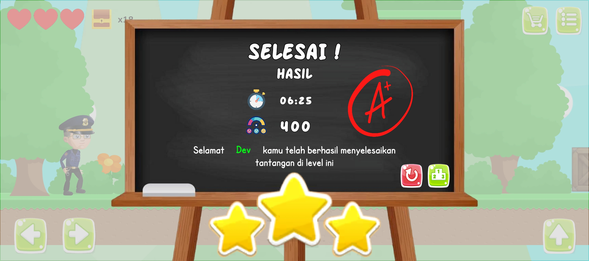

<h2>🎯 Tujuan Aplikasi</h2>

  Aplikasi ini dibuat untuk memberikan solusi media pembelajaran alternatif bagi anak usia 7-8 tahun. Dengan mengadaptasi soal-soal atau <em>quest</em> matematika dari buku Kurikulum Merdeka, game ini memvisualisasikan tantangan akademik ke dalam bentuk petualangan yang interaktif. 

  Pendekatan gamifikasi ini bertujuan untuk meningkatkan minat belajar anak, sehingga mereka dapat mengevaluasi pelajaran matematika di sekolah dengan cara yang menyenangkan dan tidak membosankan.

